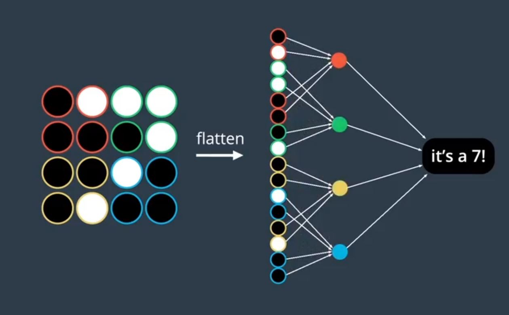

# Project Objective: 
## This project aims to acheive neural style transfer using the algorithm given by Paper [Image Style Transfer Using Convolutional Neural Networks by Gatys](https://arxiv.org/pdf/1508.06576.pdf), implemented in Pytorch.

# Theory and basic overview :
### Basics of CNN : 
Convolutional neural networks (CNN) are class of deep neural networks but differs from basic MLP (multi layer perceptron) in a way that unlike MLP , where all the neurons of the previous layers are connected to all the layers of next layers and this unnecessarily increases number of parameters whereas in CNN , at each layer only some of the neurons are connected to next layers , the neurons which are important to preserve the spatial information.
As we can see in the below picture how CNN's help in preserving spatial informative , as how these neurons are interconnected in 2D and thus helps in identifying patterns , relations among different parts of a image.

Hence, helping in extracting features , and also called feature extractors.

This works on the idea of mathematical operation called **convulation** , in simple words it is simply superimposing one function over the other and here also , we are masking the image with matrices known as **"kernels"** or **"filters"** and the results produced are called **"feature maps"**.

