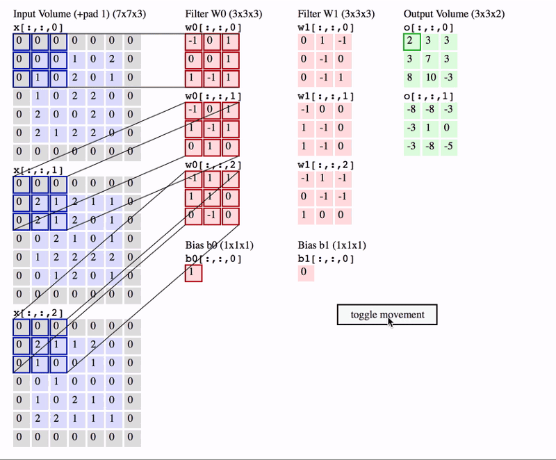
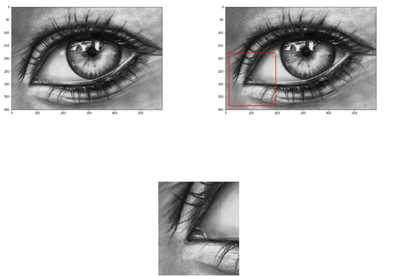
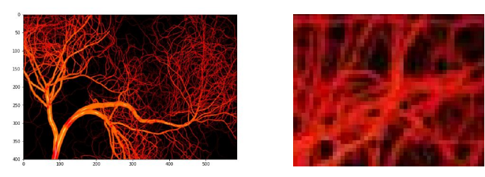
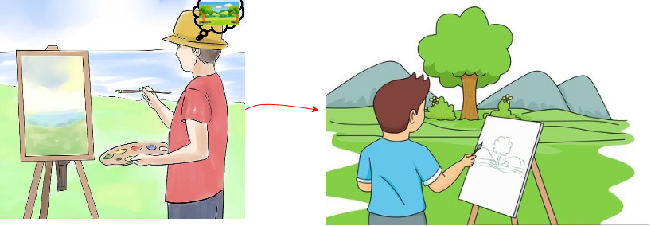
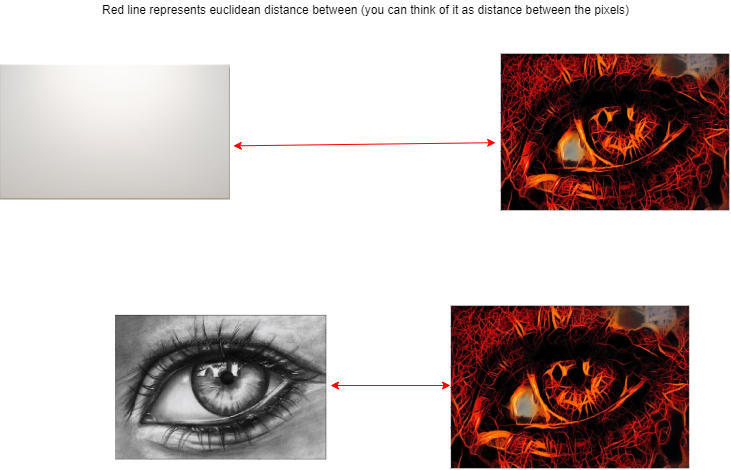
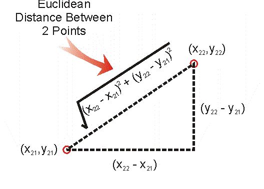

# Project Objective: 
## This project aims to acheive neural style transfer using the algorithm given by Paper [Image Style Transfer Using Convolutional Neural Networks by Gatys](https://arxiv.org/pdf/1508.06576.pdf), implemented in Pytorch.

# Theory and basic overview :
### Basics of CNN : 
Convolutional neural networks (CNN) are class of deep neural networks but differs from basic MLP (multi layer perceptron) in a way that unlike MLP , where all the neurons of the previous layers are connected to all the layers of next layers and this unnecessarily increases number of parameters whereas in CNN , at each layer only some of the neurons are connected to next layers , the neurons which are important to preserve the spatial information.
As we can see in the below picture how CNN's help in preserving spatial informative , as how these neurons are interconnected in 2D and thus helps in identifying patterns , relations among different parts of a image.

Hence, helping in extracting features , and also called feature extractors.

This works on the idea of mathematical operation called **convolution** , in simple words it is simply superimposing one function over the other and here also , we are masking the image with matrices known as **"kernels"** or **"filters"** and the results produced are called **"feature maps"**.

This graphics illustrates under the hood calculation of different feature maps which then combines over all the channels (1 for gray scale images and 3 for RGB images) produces the final result.
We can detect edges, contours based on the results of feature maps produced as sudden change in light intensity pixels confirms there is a edge so there values in features maps will signifactly differ around that region.

### Content and Style images
So, now we know how to extract features from a image using CNN.
Now, we are going to see what are content images and style images which we will be using in our algorithm to generate some new awesome artistic images.

**Content images** : images from which we are going to extract contours, borders, edges.

**Style images** : images from which we are going to extract textures, styles, artistic effects.

### The algorithmic process explained in simpler way

Suppose you start off with a empty canvas and starts painting it with your brush , and then you realized you are far away with what you imagined you would draw.
Then a idea striked you and you feel amazed to understand that in order to go towards the right direction you need to draw like following those lines which you are imagining so that difference between what you imagined and what you are drawing is miniming and thereby taking towards your final image.

Now think about this in terms of our content image and style image.
The algorithm requires that we start with our target image (which is our final image) , now there are two options for doing this :
* either we can start off by taking a empty convas
* or we can start from cloning (or copying content image)

Now let's understand this in geometrical way.
(image has been oversimplified for simplicity but mathematical explanations also lies ahead)

In the images , you can images a grid of pixels overlayed on them and try to understand.

**euclidean distance** :

We can clearly see from the image , euclidean distance between copied content image and target image is less as compared to previous one.

